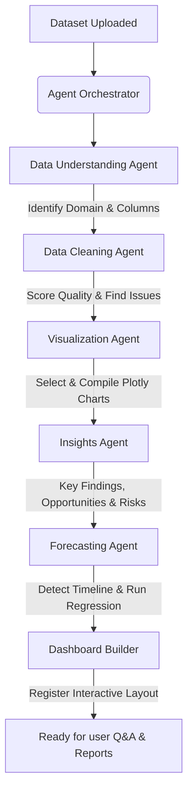

# A3: Autonomous AI-Powered Data Analytics Platform

A3 is a local-first, privacy-focused autonomous data analytics platform. It functions as a complete digital data analyst—ingesting files, validating quality, profiling tables, generating Plotly charts, running time-series predictions, executing user queries in a sandboxed Python runtime, and compiling executive PDF reports.

---

## 1. Folder Structure Overview

```
a3-analytics/
├── backend/
│   ├── app/
│   │   ├── main.py               # FastAPI entrypoint (mounts routers, DB, CORS)
│   │   ├── config.py             # System directories, JWT secrets, and Ollama settings
│   │   ├── db/
│   │   │   ├── session.py        # SQLAlchemy engine and SQLite session manager
│   │   │   └── models.py         # DB Schemas: Users, Datasets, Jobs, Chats, Dashboards, Reports, AuditLogs
│   │   ├── schemas/              # Input/Output Pydantic validations
│   │   │   ├── auth.py
│   │   │   ├── dataset.py
│   │   │   ├── chat.py
│   │   │   └── dashboard.py
│   │   ├── api/                  # REST Endpoint Routers
│   │   │   ├── deps.py           # Dependency Injections (get_db, current_user verification)
│   │   │   ├── auth.py           # Registration, login, and JWT rotation endpoints
│   │   │   ├── datasets.py       # File streaming uploads, data grid previews, and cleaning
│   │   │   ├── chat.py           # Q&A conversation thread queries
│   │   │   ├── dashboards.py     # Grid layout widgets fetch & update
│   │   │   └── reports.py        # Report generation and download streams
│   │   ├── services/
│   │   │   ├── security.py       # Bcrypt hashing and JWT token builders
│   │   │   ├── data_service.py   # Pandas-based loading, quality scoring, and cleaning
│   │   │   └── llm_service.py    # Ollama API Connector + Heuristic Mock Fallback
│   │   └── agents/               # Multi-Agent Coordination Layer
│   │       ├── orchestrator.py   # Coordinates pipeline execution thread
│   │       ├── understanding.py  # Detects domain and summaries columns
│   │       ├── cleaning.py       # Explains cleanliness narrative and suggestions
│   │       ├── visualization.py  # Builds vector Plotly figure definitions
│   │       ├── forecasting.py    # Auto time-series regression models
│   │       ├── query.py          # Sandboxed NL-to-Pandas execution environment
│   │       └── reporting.py      # Programmatic ReportLab PDF builder
│   ├── requirements.txt          # Python dependencies
│   └── Dockerfile                # FastAPI Service container definition
├── frontend/
│   ├── package.json              # Client dependencies
│   ├── tsconfig.json             # TypeScript specs
│   ├── tailwind.config.js        # Design tokens and grid styles
│   ├── next.config.js            # Node build rules
│   └── src/
│       ├── app/
│       │   ├── page.tsx          # Main dashboard, authentication card, and tab views
│       │   ├── layout.tsx        # HTML wrapper, Inter font preloads, and SEO tags
│       │   └── globals.css       # Custom radial grids, scrollbars, and glassmorphic panels
│       ├── components/
│       │   ├── chart-renderer.tsx # Dynamic, client-side Plotly wrapper
│       │   └── preview-grid.tsx  # Scrollable data table preview with header type badges
│       └── lib/
│           └── api.ts            # Axios configuration with automatic JWT refresh interceptors
├── docker-compose.yml            # Multi-container coordinator
└── README.md                     # Platform documentation
```

---

## 2. Multi-Agent Architecture

A3 coordinates specialized analytical jobs through a centralized **Agent Orchestrator** in a sequential pipeline:



1. **Orchestrator Agent**: Sets job status, loads file data, chains execution, catches exceptions, and logs action details to audit tables.
2. **Data Understanding Agent**: Reviews column summaries and sample rows. Classifies dataset (e.g. E-Commerce, Healthcare) and writes a dictionary explaining what each column represents.
3. **Data Cleaning Agent**: Determines missing count ratios and duplicate rows. Computes a quality score (0-100) and describes issues and recommended actions.
4. **Visualization Agent**: Identifies column types to programmatically create interactive Plotly charts (Time series line charts, category bar charts, histograms, correlation matrices).
5. **Insights Agent**: Runs correlation calculations and categorizations, feeding parameters to the LLM to write bulleted Key Findings, Opportunities, and Risks in executive-grade prose.
6. **Forecasting Agent**: Auto-detects temporal indexes, aggregates target values, fits a local regression model (with polynomial/seasonal parameters), projects next span, and compiles a Plotly prediction chart.
7. **Query Agent**: Translates user chat questions into sandboxed Pandas scripts, executes them, and returns text replies alongside custom visualizations.
8. **Reporting Agent**: Combines metadata summaries, quality scorecard tables, key findings, and forecast commentary, compiling a printable PDF using `reportlab`.

---

## 3. Sandboxed Code Execution Safety

To execute natural language queries, the **Query Agent** writes a short Python script using the LLM and runs it locally against the dataset DataFrame. To protect system security:
- **Keyword Validation**: Before executing, the script text is validated to ensure it contains no prohibited commands like `__import__`, `open`, `shutil`, `sys.`, `os.`, `subprocess`, `pickle`, `requests`, `eval`.
- **Restricted Namespace**: The script runs inside `exec` with restricted globals and isolated locals. The namespace is limited to the loaded DataFrame `df`, standard packages (`pandas`, `numpy`), and output placeholders (`result_text`, `result_chart`).
- **Standard Capture**: Any printed terminal text is caught in a buffer to retrieve stdout responses, and execution errors are caught gracefully, falling back to a local keyword-based parser.

---

## 4. Local Quickstart Guide

### Prerequisites
- **Node.js** (v18 or higher)
- **Python** (v3.10 or higher)
- **Ollama** (Running locally on your host machine)

### 1. Start Local Ollama
To run with maximum privacy, download and run Ollama. Download the default model:
```bash
ollama run qwen2.5:latest
# Or Llama 3
# ollama run llama3:latest
```
Ensure Ollama accepts requests from your browser/container environment. On Windows, close Ollama from the system tray and start it in terminal:
```powershell
$env:OLLAMA_HOST="0.0.0.0"
$env:OLLAMA_ORIGINS="*"
ollama serve
```

### 2. Start Backend API
1. Navigate to backend:
   ```bash
   cd backend
   ```
2. Install Python packages:
   ```bash
   pip install -r requirements.txt
   ```
3. Run FastAPI application:
   ```bash
   python -m uvicorn app.main:app --reload
   ```
   The backend will start at `http://localhost:8000`. Database tables will be auto-created in `./a3_analytics.db` on start.

### 3. Start Frontend Client
1. Navigate to frontend:
   ```bash
   cd ../frontend
   ```
2. Install Node packages:
   ```bash
   npm install
   ```
3. Run Next.js in development mode:
   ```bash
   npm run dev
   ```
   Open your browser at `http://localhost:3000`.

---

## 5. Docker Deployment

To launch the entire platform, run from the root directory:
```bash
docker compose up --build
```
This starts:
- **backend** container at `http://localhost:8000` (SQLite files and uploads map to local folder `/backend/uploads`).
- **frontend** container at `http://localhost:3000` (rebuilding client code and pointing to backend API).
- The backend container automatically communicates with the host machine's Ollama service using `host.docker.internal:11434`.
"# a2-3" 
